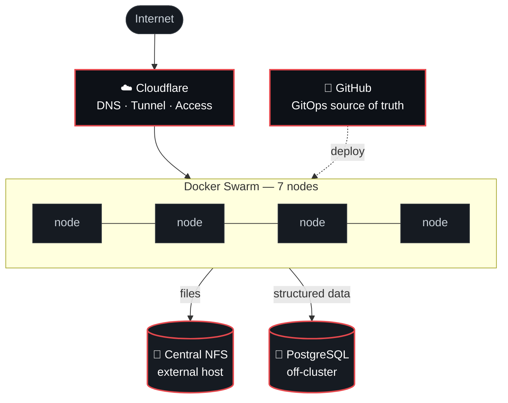

<div align="center">


```
███████╗██╗ ██████╗ ███████╗ ██████╗
██╔════╝██║██╔════╝ ██╔════╝██╔═████╗
███████╗██║██║  ███╗█████╗  ██║██╔██║
╚════██║██║██║   ██║██╔══╝  ████╔╝██║
███████║██║╚██████╔╝███████╗╚██████╔╝
╚══════╝╚═╝ ╚═════╝ ╚══════╝ ╚═════╝
```

**Sometimes I solve problems. Sometimes I create them.**


<br />

[](https://zer0space.com)
[](https://dashboard.zer0space.com/)
[](https://github.com/zer0space-net/zer0space-docs)
[](#)

</div>

---

## `~/whoami`

I build infrastructure that I then have to maintain, which keeps me honest about the decisions I make.

Most of my work lives in **[zer0space](https://github.com/zer0space-net)** — a homelab I run like production: nine machines, GitOps-managed, documented in public including the parts that aren't finished yet.

```yaml
location:  Switzerland
focus:     [ cloud, linux, automation, self-hosting, distributed-systems, ai ]
currently: making a 9-node swarm survive its own operator
motto:     "ready" is not the same as "handling traffic"
```

---

## `~/zer0space` — the ecosystem

> A documented homelab. Nine machines, stateless architecture, no open ports.



<details>
<summary><b>▸ Why it's built this way</b></summary>

<br />

**Stateless as an upfront constraint.** Seven Swarm nodes hold no persistent data. Files live on a central NFS mount reachable by every node; structured data lives in PostgreSQL on a separate host. Any node can be wiped and rebuilt without losing a byte.

**No exposed ports.** Cloudflare handles DNS, tunneling and authentication. Nothing is port-forwarded from the network.

**GitOps or it didn't happen.** Configuration lives in GitHub and is the source of truth. Deploys are driven from the repo — no snowflake changes on a box at 2am.

**Documented honestly.** The docs say what works *and* what doesn't. Offsite backups and restore testing are still open — writing that down is the point.

</details>

<details>
<summary><b>▸ Lessons I paid for</b></summary>

<br />

| Lesson | What it actually means |
| :-- | :-- |
| Question every component | "Does this box earn its power draw?" is a real question |
| Ready ≠ handling traffic | A green healthcheck is a claim, not a proof |
| Statelessness is a constraint | Retrofitting it costs 10× what designing for it does |
| The dangerous backup | Isn't the one that fails loudly — it's the one that lies about succeeding |

</details>

<details>
<summary><b>▸ Current status</b></summary>

<br />

```diff
+ 7-node Docker Swarm            operational
+ Central NFS storage            operational
+ PostgreSQL backend             operational
+ GitOps deployments             operational
+ Nightly backups                operational
- Offsite backups                not yet
- Restore testing                not yet
```

</details>

---

## `~/projects`

<table>
<tr>
<td width="50%" valign="top">

### 📖 [zer0space-docs](https://github.com/zer0space-net/zer0space-docs)
The architecture, the build journey, the reasoning. No configs, no secrets — just the patterns worth copying.

</td>
<td width="50%" valign="top">

### 📊 [zer0space-dashboard](https://github.com/zer0space-net/zer0space-dashboard)
`JavaScript` — the central view of the whole ecosystem. → [live](https://dashboard.zer0space.com/)

</td>
</tr>
<tr>
<td width="50%" valign="top">

### 🟢 [zer0space-status](https://github.com/zer0space-net/zer0space-status)
Public status page. Because "it's up for me" isn't monitoring.

</td>
<td width="50%" valign="top">

### 🔴 [crimson](https://github.com/zer0space-net) `client` · `backend`
Split-stack project running on the swarm.

</td>
</tr>
</table>

---

## `~/stack`

<div align="center">

**Core**


**Infrastructure**


**AI & Automation**


</div>

---

## `~/stats`

<div align="center">


<br />


<br />


</div>

---

<div align="center">

### `~/contact`

[](https://github.com/Sige0)
[](https://github.com/zer0space-net)
[](https://zer0space.com)

<br />

<sub>Built on nine machines that mostly agree with each other.</sub>


</div>
